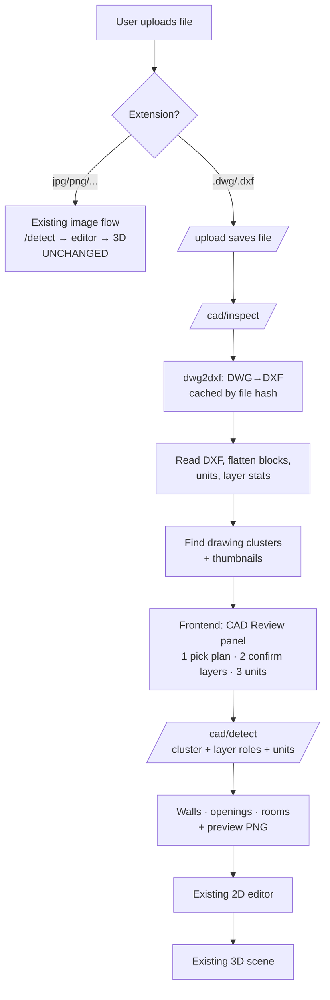

# CAD (DWG / DXF) Input — Implementation Plan

**Branch:** `Yuvraj` · **Folder:** `cad update folder/` · **Status:** Plan (no code yet)

Goal: let DreamSpace accept 2D AutoCAD drawings (`.dwg`, `.dxf`) as input,
alongside the existing JPG/PNG flow, and feed them into the same 2D editor →
3D walkthrough pipeline. Image uploads must keep working exactly as they do today.

---

## 1. Decisions already made

| Topic | Decision |
|---|---|
| Reading `.dwg` | **LibreDWG** (`dwg2dxf` command-line tool) converts DWG → DXF; `.dxf` is read directly |
| Identifying walls/doors/windows | **Auto-detect + review step**: system guesses layer roles, user confirms/corrects in a checklist |
| Files with several drawings / non-plans | **User picks the plan**: detect separate drawing clusters, show thumbnails, user clicks one |
| Code location | Everything CAD-specific lives in `cad update folder/` on the `Yuvraj` branch; only thin hook-ins touch existing files |
| Cost | **Free only.** No paid APIs, subscriptions, cloud services, or anything needing a card |

## 2. Free tool stack (all zero cost)

| Tool | Licence | Cost | Used for |
|---|---|---|---|
| LibreDWG (`dwg2dxf`) | GPLv3 | Free | DWG → DXF conversion (run as a separate program) |
| ezdxf 1.4.4 *(already installed)* | MIT | Free | Read DXF, flatten blocks, bounding boxes, render previews |
| matplotlib 3.10 *(already installed)* | Matplotlib (BSD-style) | Free | Backend for ezdxf's drawing add-on → preview PNGs |
| shapely | BSD | Free | Polygonize wall network into rooms |
| OpenCV / NumPy / scikit-image *(already used)* | BSD/Apache | Free | Raster fallbacks, reuse of existing wall-cleanup helpers |

Not used: ODA File Converter, Autodesk APIs, any cloud CAD service.

GPL note: calling `dwg2dxf` as a separate program costs nothing and needs no
licence purchase. If LibreDWG binaries are ever *bundled and redistributed*
with the project, include its licence text and a source link. We will **not**
commit the binaries to git; they're installed per machine (see §9).

LibreDWG status (from gnu.org/software/libredwg): *beta*; the reader "is done,
just some very advanced R2010+ entities fail to read and are skipped over."
Your samples are R2004–R2018, so Phase 0 exists to measure this on real files
before we build on it.

---

## 3. How it fits the current app

Existing touchpoints (unchanged behaviour for images):

| File | What it does today | CAD impact |
|---|---|---|
| `backend/main.py` | `/upload` (image exts only), `/detect/{filename}` → `run_detection` | Add CAD extensions + mount CAD router (~15 lines) |
| `frontend/src/components/UploadPanel.jsx` | File picker (`accept=image/*`), blob-URL preview | Accept `.dwg/.dxf`; route CAD files to review step |
| `frontend/src/App.jsx` | upload → detect → editor → 3D | New `cad-review` view between upload and editor |
| `DetectionOverlay.jsx` | Draws SVG over `imageUrl` using `detection.image_size` | Works as-is if given a preview PNG |
| `FloorPlanEditor.jsx` | Konva background from `imageUrl`, scales by `image_size` | Works as-is if given a preview PNG |
| `SceneCanvas.jsx` | Real-world scale from `stats.scale_ft_per_px`; room names from `room.type` | Works as-is — CAD gives an **exact** scale |
| `DetectionStats.jsx` | Shows `image_size`, stats | Small label tweak ("CAD · vector") |

**Key design idea — the "virtual image".** The CAD pipeline outputs the same
JSON schema as the image pipelines, in a pixel coordinate space, **and** renders
the chosen plan to a PNG of exactly that pixel size. The frontend uses that PNG
as `imageUrl`. So the Detect view, 2D editor and 3D scene need little or no change,
and overlays line up perfectly with the drawing.

## 4. End-to-end flow



---

## 5. Folder layout (all new code)

```
cad update folder/
├── CAD_INPUT_PLAN.md          ← this file
├── README.md                  ← install LibreDWG, run tests (Phase 5)
├── backend/
│   └── cad/
│       ├── __init__.py
│       ├── converter.py       LibreDWG wrapper: locate dwg2dxf, timeout, cache, errors
│       ├── loader.py          ezdxf.recover read, units, block flattening
│       ├── layers.py          per-layer stats + auto role guess
│       ├── clusters.py        split file into separate drawings, rank them
│       ├── walls.py           segments → wall centerlines + thickness
│       ├── openings.py        doors/windows from blocks, arcs, wall gaps
│       ├── rooms.py           polygonize walls → rooms, attach text labels
│       ├── render.py          preview PNG + cluster thumbnails
│       ├── pipeline.py        orchestrator → detection JSON (same schema)
│       ├── routes.py          FastAPI APIRouter (/cad/*)
│       └── tests/
│           ├── make_fixtures.py   builds small synthetic DXFs with ezdxf
│           └── test_*.py
└── frontend/
    ├── cadApi.js              fetch wrappers for /cad/*
    ├── cadUtils.js            isCadFile, role labels, unit options
    └── CadReviewPanel.jsx     plan picker + layer checklist + unit picker
```

Hook-ins outside the folder (kept small, listed so reviews are easy):
- `backend/main.py`: add `cad update folder/backend` to `sys.path`, `app.include_router(cad_router)`, accept `.dwg/.dxf` in `/upload`.
- `backend/requirements.txt`: `ezdxf`, `shapely` (matplotlib already present).
- `frontend/vite.config.js`: alias `@cad` → `../cad update folder/frontend`, `server.fs.allow: ['..']`, `resolve.dedupe: ['react', 'react-dom']` (so files outside `frontend/` resolve React from `frontend/node_modules`).
- `frontend/src/components/UploadPanel.jsx`: accept `.dwg,.dxf`; CAD → `onCadUpload`.
- `frontend/src/App.jsx`: `cad-review` view + `cadSession` state.

---

## 6. Backend API contract

### `POST /upload` (existing, extended)
Accepts `.dwg` / `.dxf` too (size cap **50 MB**; your largest sample is ~35 MB).
Response adds `"kind": "cad"` or `"kind": "image"`.

### `POST /cad/inspect/{filename}`
Converts (if DWG), reads, analyses. No wall generation yet.
```json
{
  "session_id": "sha256-of-file",
  "source": {"format": "dwg", "version": "AC1032", "converter": "libredwg"},
  "units": {"insunits": 4, "detected": "mm", "confidence": "header|dimensions|guess"},
  "clusters": [
    {"id": "c0", "bbox": [x0,y0,x1,y1], "thumbnail_url": "/cad/thumb/<sid>/c0.png",
     "wall_score": 0.82, "suggested": true}
  ],
  "layers": [
    {"name": "A-WALL", "color": "#ffffff", "entities": 412,
     "types": {"LINE": 380, "LWPOLYLINE": 32},
     "suggested_role": "wall", "confidence": 0.9}
  ],
  "warnings": ["23 entities skipped by converter (unsupported R2010+ types)"]
}
```

### `POST /cad/detect/{filename}`
Body: `{"cluster_id": "c0", "layer_roles": {"A-WALL": "wall", "DOOR": "door", ...}, "units": "mm"}`
Returns the **standard detection JSON** (same shape as `ml_detector`) plus:
`"source": "cad"`, `"preview_url"`, `stats.engine = "cad_vector"`,
`stats.scale_ft_per_px` (exact), walls with `length_ft`, rooms with
`label`, `area_sqft`, `computed_dim_ft`.

### `GET /cad/preview/{session_id}/{cluster_id}.png`, `GET /cad/thumb/...`
Static PNGs from the cache folder.

### `GET /cad/health`
`{"dwg2dxf": true|false, "version": "..."}` so the UI can show a clear
"DWG support not installed — upload DXF instead" message.

### `POST /detect/{filename}` on a CAD file
Runs the full **automatic** path (suggested cluster + suggested roles). Useful for
tests and scripts; the UI always goes through the review step.

---

## 7. Processing pipeline (backend detail)

**7.1 Convert (`converter.py`)**
- Locate `dwg2dxf` via env var `LIBREDWG_DWG2DXF`, then `PATH`.
- Run as a subprocess with a timeout (60 s default), output to a temp dir, then
  move into `uploads/cad_cache/<sha256>/plan.dxf`. Reuse on re-upload.
- Map failures to clear messages: not installed / timed out / unsupported version / empty output.
- Exact CLI flags are confirmed in Phase 0 (`dwg2dxf --help`) before coding.

**7.2 Load (`loader.py`)**
- `ezdxf.recover.readfile` (tolerates slightly malformed DXF from the converter).
- Model space only (v1). Flatten `INSERT` blocks recursively with their transforms
  (`virtual_entities`), keeping the effective layer (block content on layer `0`
  inherits the INSERT's layer), and remembering the source block name.
- Units: `$INSUNITS` → metres/feet. If unitless (0) or suspicious: infer from
  `DIMENSION` entities (measured value vs geometric length), then door widths
  (~0.7–1.0 m), then typical wall thickness. If still unsure, mark
  `confidence: "guess"` and the review panel asks the user. **No silent guessing.**

**7.3 Layer roles (`layers.py`)**
Roles: `wall`, `door`, `window`, `room_label`, `ignore` (dims, furniture, hatch, grid, title…).
Score per layer from:
- Name keywords (English + common variants): `wall, a-wall, mur, brick, partition`,
  `door, dr`, `window, win, glz`, `text, room, name, label`, `dim, furn, grid, axis, hatch, title`…
- Geometry signature: share of axis-aligned segments; **parallel pairs 75–450 mm
  apart** (strong wall sign); quarter-circle ARCs (door swings); TEXT/MTEXT count;
  solid HATCH inside line pairs (filled walls).
Output a suggested role + confidence per layer; the UI shows it pre-selected.

**7.4 Drawing clusters (`clusters.py`)**
- Bounding boxes of all non-ignored entities → coarse occupancy grid →
  dilate by ~1.5 m (real units) → connected components = clusters.
- Drop title blocks/borders (large thin rectangle with lots of text), tiny clusters.
- Rank by wall score (paired parallel lines, closed loops); top one pre-selected.
- Render a thumbnail per cluster (`render.py`).

**7.5 Walls (`walls.py`) — vector first, raster fallback**
1. Collect segments from `wall` layers inside the chosen cluster (LINE, LWPOLYLINE,
   POLYLINE; ARCs approximated to short segments).
2. Snap near-orthogonal angles; merge collinear overlaps.
3. **Pair parallel segments** (overlapping span, spacing 75–450 mm) → one centerline +
   real thickness per overlap span.
4. Unpaired wall-layer segments → single-line walls with default thickness (150 mm).
5. Wall HATCH boundaries → polygons → centerline via raster skeleton.
6. Clean up with the **existing** helpers (`_merge_lines`, `_snap_endpoints`,
   `_coaxial_merge`, `_heal_junctions`, `_classify_wall_types`) so CAD walls behave
   like image walls downstream.
7. Fallback when pairing coverage is poor: rasterize wall layers and reuse
   `ml_detector._walls_from_mask` (skeleton path).

**7.6 Openings (`openings.py`)**
- Doors: INSERTs on door layers / with door-like block names → hinge + width from
  block extents; loose ARC (80–100° sweep) + adjacent line → door, width = radius.
- Windows: INSERTs on window layers; or 2–4 short parallel lines bridging a wall gap.
- Gaps in paired walls with a door/window nearby → opening attached to that wall
  (`wall_id`, `x`, `y`, `width_px`, `type`), matching the existing opening schema.

**7.7 Rooms (`rooms.py`)**
- Temporarily close door/window gaps, then `shapely.ops.polygonize` the wall
  centerline network → exact room polygons. Raster flood-fill (same approach as
  `ml_detector._rooms_from_geometry`) as fallback.
- Name: TEXT/MTEXT inside the polygon on `room_label` layers (or any text layer).
  Keep raw text as `label`; map to the app's type vocabulary for `type`
  (`bedroom, kitchen, bath, living_room, dining, closet, storage, balcony, …`) via a
  keyword table (`BED ROOM 1` → `bedroom`, `TOILET`/`WC` → `bath`, `DRAWING ROOM` → `living_room`).
  Unknown → `undefined` (the UI already handles that).
- Dimension text inside a room (e.g. `12'0" x 10'0"`, `3600 x 3000`) → `label_dim`.

**7.8 Output + preview (`pipeline.py`, `render.py`)**
- Choose pixels-per-unit so the plan's longest side is ~2000 px; transform everything
  into that pixel space (Y flipped: CAD is Y-up, images are Y-down).
- `stats.scale_ft_per_px` is exact from units, so the 3D scene gets true proportions
  with no OCR.
- Render the selected cluster (only non-ignored layers, light-on-dark to match the
  UI) with ezdxf's drawing add-on + matplotlib into a PNG of exactly `image_size`.

---

## 8. Frontend UX

1. **Upload:** picker accepts `.dwg,.dxf`. For CAD files, status shows
   "Reading CAD drawing…" and calls `/cad/inspect` instead of `/detect`.
2. **CAD Review** (new view, replaces the Detect tab for CAD files):
   - **Step 1 · Pick the plan:** thumbnail grid of clusters, suggested one highlighted.
     Single-cluster files skip this step automatically.
   - **Step 2 · Confirm layers:** table of layers (name, colour swatch, entity count,
     role dropdown pre-filled). Hovering/toggling a layer highlights it in a large preview.
     "Hide ignored layers" toggle.
   - **Step 3 · Units** (only shown if confidence isn't `header`): mm / cm / m / in / ft,
     with a sanity readout ("building ≈ 12.4 m × 9.8 m").
   - **Generate walls** → `/cad/detect` → app sets `imageUrl = preview_url` and
     `detection = result`, then jumps to the existing **Editor** view.
3. **Editor / 3D:** unchanged. Header badge reads "CAD · vector" instead of "OpenCV".
4. **Errors:** DWG support missing → message + "upload DXF instead"; converter
   failure → show the reason + suggest *Save As → DXF* in AutoCAD or the free LibreCAD.
5. **Image flow:** untouched — JPG/PNG never enter any CAD code.

---

## 9. Installing LibreDWG (free) — per machine

- **Windows (dev):** download the Windows build from LibreDWG's GitHub releases
  (linked from gnu.org/software/libredwg), extract to e.g. `C:\tools\libredwg\`,
  set `LIBREDWG_DWG2DXF=C:\tools\libredwg\dwg2dxf.exe` (or add to `PATH`).
- **Linux (deploy):** distro package if available, else build from source (free).
  Verify at deploy time.
- Binaries are **not** committed to git.
- `/cad/health` + a startup log line report whether it's found.

---

## 10. Phased delivery (each phase = its own commit on `Yuvraj`)

### Phase 0 — Feasibility spike (½–1 day)
- Install LibreDWG (asks for your go-ahead before downloading).
- Convert all 9 sample DWGs; record success / time / skipped entities / layer names.
- Classify each sample: floor plan vs not.
- **Gate:** if the floor-plan samples convert cleanly, continue. If key ones fail,
  we pause and decide together (e.g. DXF-only for affected versions).

| Sample | Version | Size | Expected |
|---|---|---|---|
| Small-country-house-with-gazebo-1005201.dwg | R2018 | 0.8 MB | floor plan |
| Simple-Country-house-1806201-VER04.dwg | R2004 | 2.7 MB | floor plan |
| Big-House-Patio-Terrace.dwg | R2004 | 0.3 MB | floor plan |
| House-plan-three-bedroom.zip → THREE BEDROOM HOUSE PLAN.dwg | ? | 0.9 MB | floor plan |
| Ishverbhai Punna.dwg | R2007 | 0.8 MB | to classify |
| LINE OUT.dwg | R2010 | 0.5 MB | to classify |
| MANDIR mahadev location-6.dwg | R2018 | 0.1 MB | likely site/location drawing |
| WORKING DRAWING FOR TOWER-B _ COLUMN & FOOTING.dwg | R2010 | 35 MB | structural, not a floor plan (stress test) |
| AUTOCAD_Library.dwg | R2004 | 19 MB | block library, not a floor plan |

### Phase 1 — Backend foundation (2–3 days) — ✅ done
`converter.py`, `loader.py`, `layers.py`, `clusters.py`, `render.py` (thumbnails),
`routes.py` with `/cad/health` and `/cad/inspect`, main.py hook-in, synthetic DXF fixtures + tests.
**Done when:** inspect returns sensible clusters/layers for every floor-plan sample.

**Result:** correct plan auto-picked for all 4 readable floor-plan samples; non-plans
(site, structural) report "nothing looks like a floor plan"; 26 unit tests + existing
image regression tests pass. Floor-plan inspect time 1–10 s. What changed vs. the plan:
- **Header units are unreliable** (wrong in 3 of 7 samples) → `units.py` picks the unit
  from geometry (wall-pair spacing, door-swing radius, plausible size); header only breaks ties.
- **LibreDWG can drop walls silently** (THREE BEDROOM: labels + dimensions kept, walls gone;
  Tower-B: everything gone) → such plans are listed as `plan_without_walls` with a
  "save as DXF" warning; an empty drawing is a conversion error.
- Elevations are demoted by their long diagonal roof lines; drawings < 5 m (schedules,
  details) are penalised; only confident floor plans are auto-suggested.
- Clustering grid is 0.5 m (keeps two copies of a plan ~1 m apart separate); groups nested
  inside a bigger drawing's outline (mid-room furniture, facade windows) are folded into it.
- Thumbnails use OpenCV line drawing (+ room names), not full rendering (617 s on the library).
- **Carried to Phase 4:** the 19 MB block library takes ~92 s (read 39 s, block expansion 26 s,
  clustering 12 s) — needs background processing + progress, or block-expansion limits.

### Phase 2 — Geometry (3–4 days)
`walls.py`, `openings.py`, `rooms.py`, `pipeline.py`, preview render, `/cad/detect`,
auto path on `/detect`. Overlay debug images (like the existing `diag_*` scripts).
**Done when:** walls/rooms/doors look right on the overlay for the floor-plan samples,
and wall lengths match the drawing's own dimensions within ~2%.

### Phase 3 — Frontend (2–3 days)
Vite alias/dedupe config, `cadApi.js`, `cadUtils.js`, `CadReviewPanel.jsx`,
UploadPanel/App hook-ins, error states.
**Done when:** upload DWG → pick plan → confirm layers → editor → 3D works in the browser.

### Phase 4 — Integration & polish (1–2 days)
Exact scale into 3D, stats panel labels, caching, large-file behaviour (35 MB sample),
progress messages, room label mapping table tuned on samples.

### Phase 5 — Hardening & docs (1 day)
Regression pass on JPG/PNG samples (must be identical to before), README for
install/tests, final commit on `Yuvraj`.

Rough total: **~10–14 working days**.

---

## 11. Testing strategy

- **Unit (synthetic DXF built with ezdxf, no binaries needed):** double-line walls,
  single-line walls, walls in blocks, door blocks, arc doors, text labels, unitless file,
  two side-by-side plans, title block.
- **Integration:** the sample DWGs above (skipped automatically if LibreDWG isn't installed).
- **Regression:** existing image tests (`backend/tests`, `e2e_test.py`) plus the three
  diagnostic images (`3br_cad.jpg`, `sample_clean_cad_2bhk.jpg`, `KrupalBachpan_Plan_2bhk.jpg`)
  must produce the same walls/rooms as before.
- **Browser check:** full upload → review → editor → 3D run for one DWG and one JPG.

## 12. Risks & mitigations

| Risk | Mitigation |
|---|---|
| LibreDWG skips some R2010+ entities (beta) | Phase 0 measures it; preview shows what was read; `warnings` list; DXF upload always works |
| Layer names are inconsistent across offices | Geometry-based scoring + user review step |
| Walls drawn only as hatches / single lines | Hatch→skeleton path; single-line default thickness |
| Unitless drawings (common in Indian/hobby files) | Infer from dimensions/doors; ask the user when unsure |
| Huge files (35 MB) slow or time out | 50 MB cap, converter timeout, cache by hash, cluster before heavy geometry |
| Non-English / SHX-font text | Keep raw label; mapping falls back to `undefined` |
| Curved walls | ARCs approximated to segments (v1) |
| Vite importing files outside `frontend/` | `fs.allow` + alias + `dedupe`; fallback below (open decision 3) |

## 13. Out of scope for v1
3D solids/BIM data, paper-space layouts, external references (xrefs), multiple floors
stacked into one building, editing/saving back to DWG, `.zip` uploads (open decision 1).

---

## 14. Open decisions (defaults used unless you say otherwise)

1. **`.zip` uploads** (one of your samples came zipped): default **not supported in v1**
   (unzip first). Easy to add later.
2. **Unitless drawings:** default **infer, then ask** in the review panel (never silently assume).
3. **Frontend CAD files location:** default **inside `cad update folder/frontend`** with the
   Vite alias. If that proves fragile, fallback is `frontend/src/cad/` (I'll ask first).
4. **Pushing:** default **commit per phase on `Yuvraj`, push only when you ask.**
